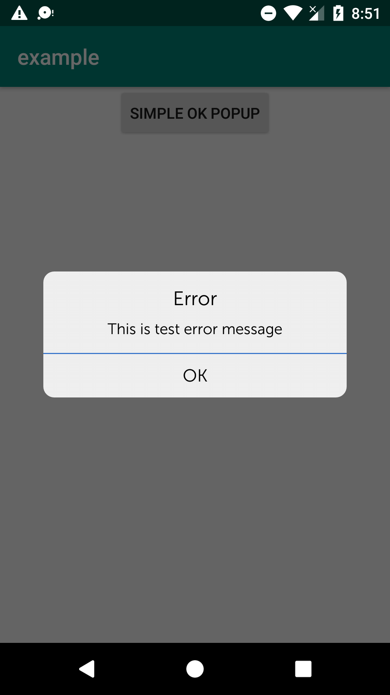

# DialogBox
A simple library in kotlin to show popups 

# Setup

Step 1. Add the JitPack repository to your build file

	allprojects {
		repositories {
			...
			maven { url 'https://jitpack.io' }
		}
	}
  
Step 2. Add the dependency

Get the latest version from here 

~~~
dependencies {
	        implementation 'com.github.muazzam27:DialogBox:0.3'
	}
~~~
 

# Usage

A basic message：

~~~

 DialogBox(this@MainActivity)
            .setTitleLabel("Error")
            .setMessageLabel("This is test error message")
            .setActionLabel("OK")
            .setTitleColor(resources.getColor(R.color.vpi__background_holo_dark))
            .setMessageColor(resources.getColor(R.color.vpi__background_holo_dark))
            .setDividerColor(resources.getColor(R.color.color_standard_blue))
            .setActionButtonColor(resources.getColor(R.color.vpi__background_holo_dark))
            .setTitleTextSize(TypedValue.COMPLEX_UNIT_SP,18f)
            .setMessageTextSize(TypedValue.COMPLEX_UNIT_SP,14f)
            .setActionTextSize(TypedValue.COMPLEX_UNIT_SP,16f)
            .setTitleTypeFace(Typeface.createFromAsset(applicationContext.assets, "font/museosans_300.ttf"))
            .setMessageTypeFace(Typeface.createFromAsset(applicationContext.assets, "font/museosans_300.ttf"))
            .setActionTypeFace(Typeface.createFromAsset(applicationContext.assets, "font/museosans_300.ttf"))
            .showPopup()

~~~

# Screenshots

# Customization

You can customize the popup by following methods

- setTitleLabel(title: String)
- setMessageLabel(title: String)
- setActionLabel(title: String)
- setTitleColor(color: Int)
- setMessageColor(color: Int)
- setActionButtonColor(color: Int)
- setTitleTypeFace(typeface: Typeface)
- setMessageTypeFace(typeface: Typeface)
- setActionTypeFace(typeface: Typeface)
- setDividerColor(color: Int)
- setTitleTextSize(unit: Int,size:Float)
- setMessageTextSize(unit: Int,size:Float)
- setActionTextSize(unit: Int,size:Float)

